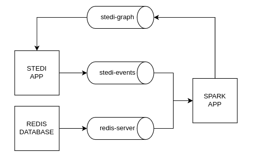
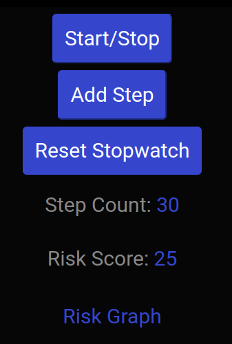
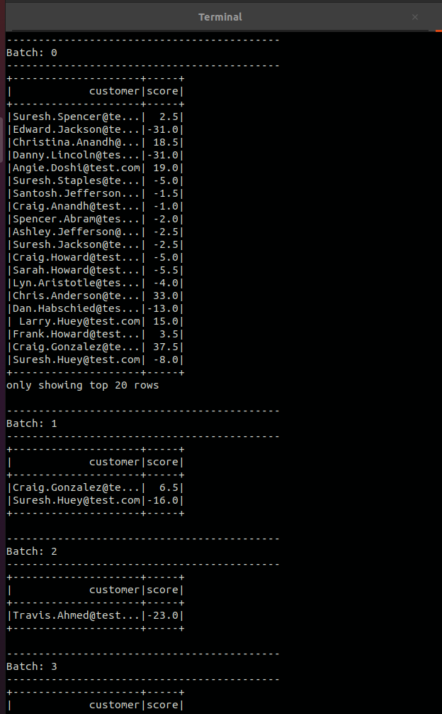
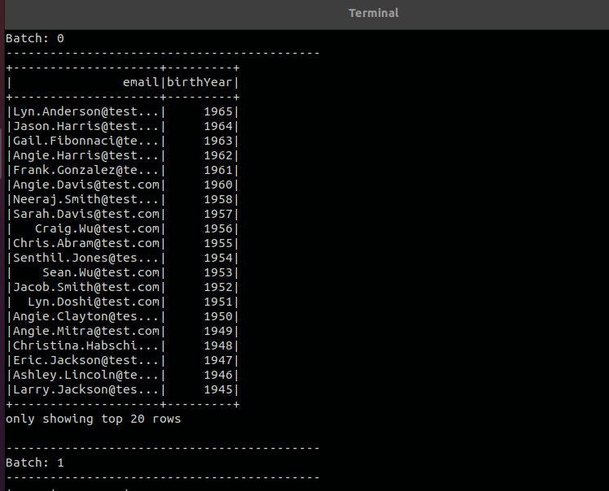
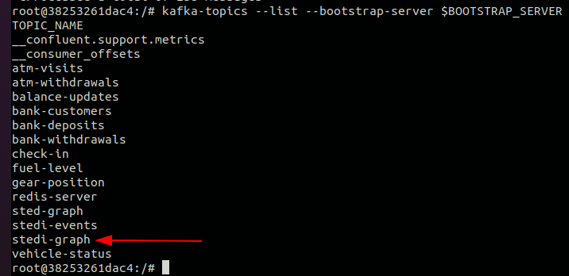
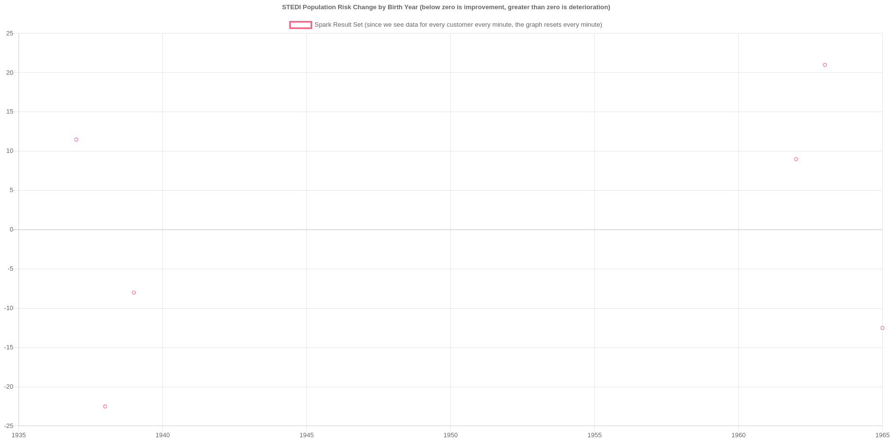
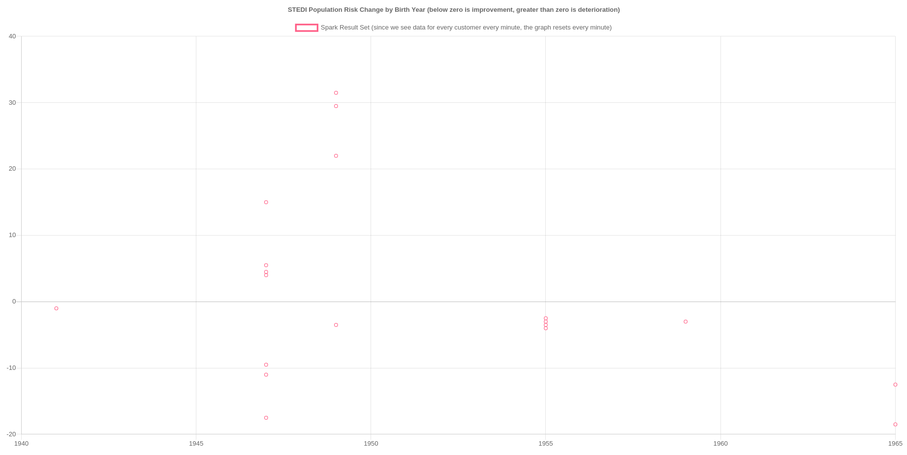

# Spark Streaming - Human-Balance-Evaluation

## 1 - Introduction and project overview

This project was developed during Udacity's "Data Streaming" Nanodegree program. It simulates a startup called "STEDI" that has an application that collects data from seniors during a small exercises.
The simulated data is sent through topics and has two different sources:
* An Application that measures the seniors actions
* A Redis Database containing user information

These two topics are joined using a Spark application, that aggregate the data and then sink it into another topic, that is consumed by the simulated application. Whith these data, a chat can be plotted with the senior's information.

The diagram below illustrates the architecture described above:



## 2 - Tecnologies and tools used
* Language: Python 3.9
* Database: Redis
* Tools: Spark, Kafka, Docker


## 3 - Infrastructure
* STEDI APP: Application that is used to simulate the data and ingest it into "stedi-events" topic.

```json
{
  "customer": "String",
  "score": "float",
  "riskDate": "String"
}
```

* REDIS DATABASE: Database that stores the user's information and ingest it into redis-server topic.

```json
{
  "customerName":"String",
  "email":"String",
  "phone":"Strig",
  "birthDay":"String"
}
```

* SPARK APP: An application that join the data that flows through stedi-events and redis-server topics and sink it into stedi-graph topic.

```json
{
  "customer":"String",
  "score":"String",
  "email":"String",
  "birthYear":"String"
} 
```

* Topics:
  * stedi-events
  * redis-server
  * stedi-graph

## 4 - Project folders/files

```
|____project
|  |____starter
|    |____sparkpyeventskafkastreamtoconsole.py
|    |____sparkpykafkajoin.py
|    |____sparkpyrediskafkastreamtoconsole.py
|    |____submit-event-kafkajoin.sh
|    |____submit-event-kafkastreaming.sh
|    |____submit-redis-kafka-streaming.sh
|
|____Spark
|  |____logs                                 
|    |____redisstream.log
|
|____docker-compose.yaml
```

* sparkpyeventskafkastreamtoconsole.py: Script that creates a streaming dataframe from the Kafka topic stedi-events as the source and prints it with two columns: "custumer" and "score" 

* sparkpyrediskafkastreamtoconsole.py:  Script that creates a streaming dataframe from the Kafka topic redis-server as the source and prints it with two columns: "email", "birthYear"

* sparkpykafkajoin.py: Scrpt that reads and join two streaming dataframes from stedi-events and redis-server topics and sinks the joined dataframes to a new kafka topic that is consumed by STEDI graph application 
  
* submit-*.sh: files to submit the respective python script to the spark streaming broker.

## 5 - Running the project

### 5.1 - Setup

Initialize the docker-compose file:
```
docker-compose up
```

Make sure the containers are all running (you should see 7 processes):
```
docker ps
```

### 5.2 - STEDI Application

- Log in to the STEDI application: http://localhost:4567

- Create a new account

- Click Create New Customer, create a test customer and submit

- Click start, then add steps until you reach 30 and the timer has stopped

- Repeat this four times, and you will receive a risk score



- Click on "Activate Simulated User Data" to simulate customers generation of data

### 5.3 - Submitting the scripts

Before submitting the scripts change the container name in the bash scripts to the one of your kafka's broker 
You can access kafka's broker bash using:
```
CONTAINER_NAME=spark-streaming-human-balance-evaluation_kafka_1
docker exec -it $CONTAINER_NAME bash
```
And inside the broker:
```
BOOTSTRAP_SERVER=localhost:19092
TOPIC_NAME=stedi-graph
kafka-topics --list --bootstrap-server $BOOTSTRAP_SERVER
kafka-console-consumer --bootstrap-server $BOOTSTRAP_SERVER --topic $TOPIC_NAME
```

* Run submit-event-kafkastreaming.sh



(check the full log at spark/logs/eventstream.log)

* Run submit-redis-kafka-streaming.sh


(check the full log at spark/logs/redis-kafka.log)

* Run submit-event-kafkajoin.sh



(creates stedi-graph topic)

(check the full log at spark/logs/kafkajoin.log)
### 5.4 - Risk Graph

* Click on Risck Graph to check the plotted graph
* This graph is updated in almost real-time consuming the data from stedi-graph topic

Two generated examples:





